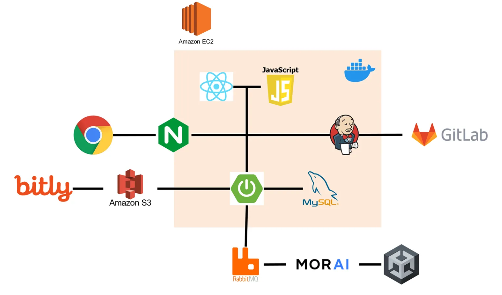

# 짐돌이 - 자율이동로봇(AMR)을 활용한 공항용 짐 운반 서비스

---

## 프로젝트 소개

프로젝트의 목적은 공항 내 승객들의 짐 이동을 자동화하여 불편함을 최소화하는 서비스를 개발하는 것입니다.

자율이동로봇(AMR)에 부착된 디스플레이에 티켓정보를 입력하면 목적지 게이트를 자동으로 인지하고, 승객이 짐을 올려놓으면 목적지까지 자동으로 운반하고 내려놓은 후 사진을 찍어 승객의 휴대폰 번호로 전송합니다. 또한, 최적의 경로 탐색을 통해 효율적인 짐 이동 서비스를 제공합니다.

### 주요 기능

- **자율 주행**: LiDAR 센서를 통한 SLAM 매핑과 A* 알고리즘을 활용한 경로 설계
- **짐 운반 및 도착 시 사진 전송**: 사용자가 디스플레이를 통해 예약정보를 입력하면 짐 운반 시작, 목적지에 도착하면 자동으로 사진 촬영 후 예약자에게 사진 전송
- **AI 챗봇**: 로봇의 디스플레이를 통해 AI 챗봇 사용 가능
- **음성 안내 및 음성 인식과 다국어 지원**: 디스플레이를 통해 음성 안내 및 음성 인식을 통한 대화, 영어 지원을 통해 외국인들도 사용 가능하도록 구현

## 프로젝트 특장점

### 기능 관점

1. **SLAM 실시간 매핑**: LiDAR 센서를 활용하여 공항을 실시간 매핑
2. **자율주행 및 장애물 인식**: 예약정보를 입력하면 목적지에 해당하는 GATE로 주행하고 장애물(물체, 사람 등)을 인식하고 피함
3. **목표 지점 도착 후 사진 전송**: AMR이 목적지에 도착하면 짐을 내린 후 사진 촬영 및 사용자에게 문자 전송까지 자동화

### 기술 관점

1. **실물 AMR과 시뮬레이터의 동기화**: 현실 AMR과 가상 시뮬레이션 간의 양방향 데이터 동기화 구현
2. **SLAM을 통한 매핑 및 자율주행 알고리즘**: SLAM을 통한 매핑으로 AMR이 공항 정보를 인지하고, A* 알고리즘을 통해 자율주행 경로 최적화
3. **짐 운반 자동화 및 사용자에게 알림 전송**: 물건을 내려놓고 나면 자동으로 사진을 찍어 DB에 저장된 사용자의 전화번호로 사진 전송 

## 팀 구성 및 역할

### 시뮬레이터 - 매핑, 경로 최적화

- 구희원
- 윤수한

### AMR 하드웨어 개발

- 이상화

### 웹 파트 FE, BE 개발

- 권은채
- 홍해지
- 김가현

### 인프라 구축

- 홍해지

## 기술 스택

### 프론트엔드 (dt_front)

- React
- JavaScript

### 백엔드 (dt_back)

- Spring Boot 2.5.5
- Java 1.8

### 데이터베이스

- MySQL

### 시뮬레이터

- MORAI
- rclpy
- Ubuntu 18.04.6
- ROS2 eloquent

### IoT
- Arduino Uno

### CI/CD \& 인프라

- EC2(Ubuntu 22.04-AMD64)
- Jenkins (자동 빌드 및 배포)
- Docker (컨테이너화 및 배포)
- Docker Portainer (컨테이너 관리)
- GitLab CI/CD

### 개발 도구

- IntelliJ
- MySQL Workbench
- VSCode
- PyCharm
- Git, GitLab, SourceTree
- Jira
- Mattermost

## 폴더 구조

```
├─advanced
│  
│  ├─advanced                   # 맵을 구현하기 위한 SLAM
│  │  │  load_map.py            # SLAM을 통해 매핑된 지도 불러오기
│  │  │  run_localization.py    # 구현된 맵에서의 터틀봇 움직임 실시간 관찰
│  │  │  run_mapping.py         # SLAM 구현 코드
│  │  │  __init__.py
│  │ 
│  ├─map                        
│  │      map.txt               # SLAM을 통해 구현된 맵 좌표 저장 텍스트 파일일
│ 
.
├─comm
│  
│  ├─comm                       # 실물 AMR - 시뮬레이터 - 백엔드 간 통신
│  │  │  .env
│  │  │  gate_receive.py        # 백엔드로부터 목적지 GATE 정보 수신
│  │  │  mqtt.py                # 전체 MQTT 통신 연결 코드
│  │  │  photo_send.py          # 짐 운반 후 저장된 사진을 백엔드로 전송
│  │  │  status_receive.py      # 긴급 정지/재가동을 위한 백엔드로부터 상태 수신
│  │  │  status_send.py         # 긴급 정지/재가동을 위한 백엔드로 상태 전송
│  │  │  __init__.py
│ 
.
├─ssafy_bridge
│  
│  ├─ssafy_bridge               # 시뮬레이터 MORAI와 ROS2 통신 코드
│  │  │  cam_viewer.py
│  │  │  ssafy_udp_parser.py
│  │  │  sub_to_udp.py
│  │  │  udp_to_cam.py
│  │  │  udp_to_laser.py
│  │  │  udp_to_pub.py
│  │  │  utils.py
│  │  │  __init__.py
│  │  │
│  │  
├─ssafy_msgs
│  │  CMakeLists.txt
│  │  package.xml
│  │
│  └─msg
│          BBox.msg
│          CustomObjectInfo.msg
│          EnviromentStatus.msg
│          HandControl.msg
│          Num.msg
│          ObjectInfo.msg
│          TurtlebotStatus.msg
.
├─sub1
│  
│  ├─sub1                       # 시뮬레이터 조작 코드
│  │  │  controller.py          # Automode/Keyboard 조작 변경
│  │  │  handcontrol.py         # 터틀봇 팔 조작 코드
│  │  │  perception.py          # 시뮬레이터에서 카메라 on/off
│  │  │  publisher.py           # 시뮬레이터와의 송수신 확인 코드
│  │  │  subscriber.py          # 시뮬레이터와의 송수신 확인 코드
│  │  │  __init__.py
│  │  │
.
├─sub2                          # A* 알고리즘 구현 코드
│  │  map.txt
│  │  package.xml
│  │  setup.cfg
│  │  setup.py
│  │
│  ├─launch
│  │      can_lift
│  │      human_detector_launch.py
│  │      path_tracking_astar_launch.py     # 코드 일괄 수행 
│  │      계속
│  │      먼저
│  │
│  ├─map
│  │      map.txt               # advanced에서 저장된 맵 좌표와 동일함
│  │
│  ├─resource
│  │      sub2
│  │
│  ├─sub2
│  │  │  auto_goal_publisher.py # 목적지 자동 설정
│  │  │  a_star.py              # A* 알고리즘 기본 코드
│  │  │  a_star_local_path.py   
│  │  │  human_detector.py      # 객체(사람) 인식
│  │  │  load_map.py            # map.txt 불러옴
│  │  │  odom.py                # 경로 설정 
│  │  │  path_tracking.py       
│  │  │  seg_binarizer.py
│  │  │  utils.py
│  │  │  __init__.py
│  │  │
```

## 설치 및 실행 방법

### 1. 프로젝트 클론

```bash
git clone https://lab.ssafy.com/s12-mobility-smarthome-sub1/S12P21E104.git
cd S12P21E104
```
## 시뮬레이터 실행
### 1. 시뮬레이터 노드 실행 (/ssafy_bridge)
```
call C:\dev\ros2_eloquent\setup.bat
call C:\Users\SSAFY\Desktop\smarthome-resources\ros2_ws\install\local_setup.bat
cd C:\Users\SSAFY\Desktop\smarthome-resources\ros2_ws\src\ssafy_bridge\launch
ros2 launch ssafybridge_launch.py
```

### 2. 시나리오 코드 실행 (path_tracking_astar_launch.py)
set RCUTILS_CONSOLE_STDOUT_LINE_BUFFERED=1

```
call C:\dev\ros2_eloquent\setup.bat
call C:\Users\SSAFY\Desktop\smarthome-resources\ros2_ws\install\local_setup.bat
cd C:\Users\SSAFY\Desktop\smarthome-resources\ros2_ws\src\sub2\launch
ros2 launch sub2 path_tracking_astar_launch.py
```

### etc. SLAM 매핑 파일 실행
**1.1. run_mapping.py**
```
cd C:\Users\SSAFY\Desktop\smarthome-resources\ros2_ws
call install\local_setup.bat
call C:\dev\ros2_eloquent\setup.bat
cd C:\Users\SSAFY\Desktop\smarthome-resources\ros2_ws\src\advanced\advanced
ros2 run advanced run_mapping
```
**1.2. run_localization.py**
```
cd C:\Users\SSAFY\Desktop\smarthome-resources\ros2_ws
call install\local_setup.bat
call C:\dev\ros2_eloquent\setup.bat
cd C:\Users\SSAFY\Desktop\smarthome-resources\ros2_ws\src\advanced\advanced
ros2 run advanced run_localization
```
**1.3 load_map.py**
```
cd C:\Users\SSAFY\Desktop\smarthome-resources\ros2_ws
call install\local_setup.bat
call C:\dev\ros2_eloquent\setup.bat
cd C:\Users\SSAFY\Desktop\smarthome-resources\ros2_ws\src\advanced\advanced
ros2 run advanced load_map
```
**1.4  rqt 실행**
```
# 토픽 구독
call C:\dev\ros2_eloquent\setup.bat
call C:\Users\SSAFY\Desktop\smarthome-resources\ros2_ws\install\local_setup.bat
rqt
```
**1.5 rviz2 실행**
```
# 목적지 찍는 용도
call C:\dev\ros2_eloquent\setup.bat
call C:\Users\SSAFY\Desktop\smarthome-resources\ros2_ws\install\local_setup.bat
ros2 run rviz2 rviz2
```
**
**2.1. HW랑 MQTT 통신**
```
call C:\dev\ros2_eloquent\setup.bat
call C:\Users\SSAFY\Desktop\smarthome-resources\ros2_ws\install\local_setup.bat
ros2 run comm mqtt
```
**2.2 백엔드랑 경로 주고 받기 (gate_receive.py)**
```
call C:\dev\ros2_eloquent\setup.bat
call C:\Users\SSAFY\Desktop\smarthome-resources\ros2_ws\install\local_setup.bat
ros2 run comm gate_receive
```
**2.2 navigation_launch.py**
```
call C:\dev\ros2_eloquent\setup.bat
call C:\Users\SSAFY\Desktop\smarthome-resources\ros2_ws\install\local_setup.bat
ros2 launch launch_package navigation_launch.py
```
## CI/CD - Jenkins + Docker 기반 자동 배포

이 프로젝트는 Jenkins와 Docker를 활용한 CI/CD를 적용하여, 코드가 변경되면 자동으로 빌드 및 배포가 이루어지도록 설정되어 있습니다.

### CI/CD 파이프라인 흐름

1. GitLab Push 이벤트 발생 → GitLab Webhook이 Jenkins를 트리거함
2. Jenkins가 프로젝트를 빌드 (Gradle/Spring Boot, React, Flask 등)
3. Docker 이미지 빌드
4. 서버에서 최신 Docker 이미지를 pull \& 실행
5. Nginx를 통해 프론트엔드 서비스 제공

## 설계 문서

- 와이어프레임: https://www.figma.com/design/9yKvC5eCKhCetS7qJCdGoM/%ED%8A%B9%ED%99%94_robot?node-id=0-1&p=f
- ERD: https://butter-chip-bcf.notion.site/DB-_ERD-1af79b5dec828117872ffca8062df8bc
- HTTP API 문서: https://butter-chip-bcf.notion.site/HTTP-API-1af79b5dec82817cae26f32c71643b27
- MQTT API 문서: https://butter-chip-bcf.notion.site/MQTT-API-1ba79b5dec8280a9be39ff604fcdc822

# 아키텍쳐


## 배포 및 테스트
배포 링크 - https://j12e104.p.ssafy.io/
테스트 계정 - 예약번호 : ABC123
<div style="text-align: center">⁂</div>